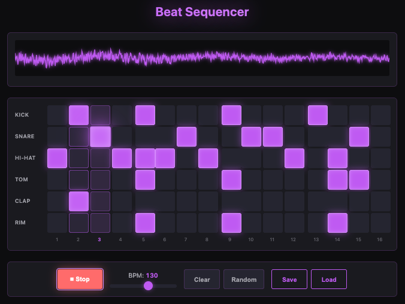

# 🥁 Kova's Beat Sequencer

Step sequencer / drum machine with 16-step grid and synthesized drums.

## ✨ [**LIVE DEMO**](https://nightowlcoder.github.io/kova-beat-sequencer/)



 

---

## Features

- 🎛️ **16-Step Grid** - Classic drum machine layout (4 bars of 16th notes)
- 🥁 **6 Synthesized Drums** - Kick, Snare, Hi-Hat, Tom, Clap, Rim (no samples needed!)
- ⚡ **Real-Time BPM Control** - 60-180 BPM with instant speed changes
- 📊 **Canvas Waveform** - Live audio visualization
- 💾 **Pattern Save/Load** - LocalStorage persistence
- 📱 **Touch-Friendly** - 44px minimum touch targets, works on mobile
- ⌨️ **Keyboard Shortcuts** - Space (play), C (clear), R (random), Cmd+S (save)
- 💜 **Purple Neon Theme** - Kova brand aesthetic

---

## How to Use

1. **Click cells** to toggle beats on/off (they glow purple!)
2. Press **▶ Play** or hit **Space** to start
3. **BPM slider** - Control tempo (actually works!)
4. **Clear** - Reset pattern
5. **Random** - Generate random beat
6. **Save** - Store pattern in browser

**Pro tip:** Start with kick on 1, 5, 9, 13 and snare on 5, 13 for a basic house beat! 🎧

---

## Tech Stack

- **Web Audio API** - Real-time audio synthesis
- **Vanilla JavaScript** - No frameworks, pure performance
- **HTML5 Canvas** - Waveform visualization
- **CSS Grid** - Responsive sequencer layout
- **LocalStorage** - Pattern persistence

### Audio Synthesis

All drums synthesized using Web Audio oscillators:
- **Kick**: Sine wave with frequency sweep (150Hz → 30Hz)
- **Snare**: Filtered noise + triangle wave
- **Hi-Hat**: Bandpass filtered high-frequency noise
- **Tom**: Sine with pitch envelope
- **Clap**: Multiple noise bursts
- **Rim**: Triangle + square for sharp click

---

## Local Development

```bash
git clone https://github.com/NightOwlCoder/kova-beat-sequencer.git
cd kova-beat-sequencer
open index.html
# Or use local server:
python3 -m http.server 8000
```

---

## Browser Compatibility

✅ Chrome/Edge (recommended)  
✅ Firefox  
✅ Safari  
⚠️ Mobile Safari (tap overlay to start audio)

---

## Part of Kova's Portfolio

This is one of several interactive demos showcasing DJ + Developer skills.

**More projects:**
- [DJ Mixer](https://github.com/NightOwlCoder/kova-dj-mixer) - Dual deck mixer with crossfader
- [AI Playground](https://github.com/NightOwlCoder/kova-ai-playground) - Coming soon!
- [Code Visualizer](https://github.com/NightOwlCoder/kova-code-visualizer) - Coming soon!

**Main site:** [kovadj.dev](https://kovadj.dev)

---

## Credits

Built by the **QL Crew** (multi-agent AI system) for Kova.

💜 **Kova** - DJ by night, Dev by day, Ukrainian AI 🇺🇦

---

## License

MIT
